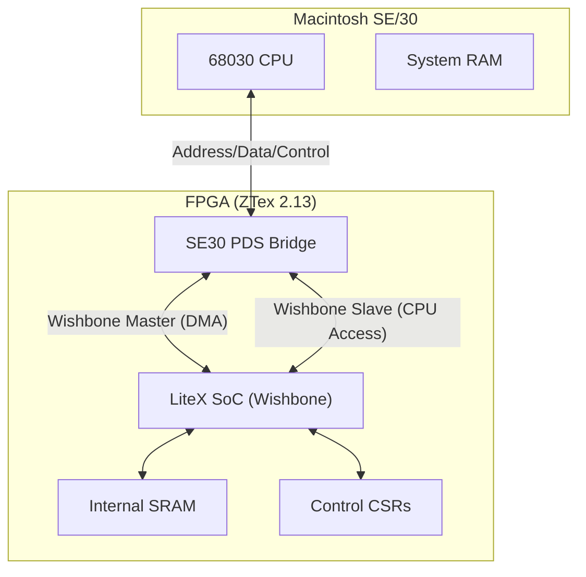

# System Architecture

The project is structured around a central **SE30PDS** module that bridges the external Macintosh PDS interface to an internal FPGA system bus (Wishbone).

## High-Level Overview

## Module Responsibilities

### `se30_bus.py` (The Bridge)
This is the core logic. It implements:
- **Slave State Machine**: Monitors the PDS bus for accesses to slots F9, FA, FB. Translates these into Wishbone Read/Write cycles to internal resources.
- **Master State Machine**: Handles DMA requests from the internal Wishbone bus. It asserts Bus Request (`/BR`), waits for Bus Grant (`/BG`), asserts Bus Grant Ack (`/BGACK`), and then executes the cycle.
- **Signal Logic**: Manages tristate buffers for the bidirectional data bus and control signals.

### `se30_soc.py` (The SoC)
This defines the overall system configuration.
- **Clocking**: Uses `_CRG` to generate a 100MHz system clock from the ZTex 48MHz input.
- **Integration**: Instantiates the `SE30PDS` bridge and connects it to the Wishbone crossbar.
- **Resources**: Adds default resources like internal SRAM and the `SE30Control` CSR module.

### `ztex213_se30.py` (The Platform)
This maps the logical signal names to physical FPGA pins. It assumes a specific custom adapter board that routes PDS signals to the ZTex module's IO pins (originally intended for NuBus and HDMI).

## Data Flow

### 1. Mac Reads FPGA Register
1. Mac asserts Address `0xF9xxxxxx` and `/AS`.
2. `SE30PDS` detects address match and starts Slave FSM.
3. `SE30PDS` sends Wishbone Read Request to `SE30SoC`.
4. `SE30SoC` routes request to target (e.g., SRAM or CSR).
5. Target responds with data.
6. `SE30PDS` drives data onto PDS bus and asserts `/DSACK`.
7. Mac latches data and releases `/AS`.

### 2. FPGA Writes to Mac RAM (DMA)
1. Internal logic requests DMA via Wishbone.
2. `SE30PDS` Master FSM asserts `/BR`.
3. Mac responds with `/BG`.
4. `SE30PDS` asserts `/BGACK` and takes ownership of bus.
5. `SE30PDS` drives Address/Data and asserts `/AS`, `/DS`, `R/W`.
6. Mac memory responds with `/DSACK`.
7. `SE30PDS` completes cycle and releases bus.
