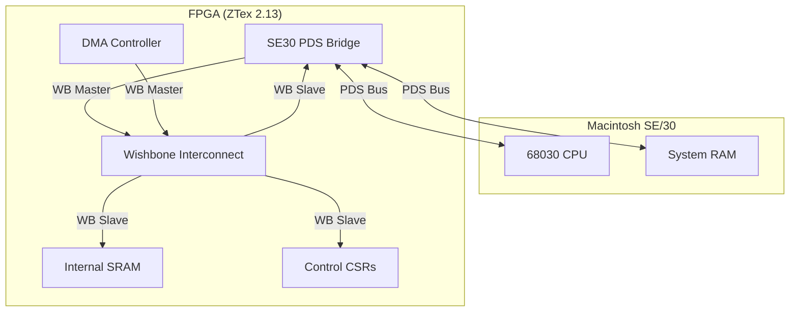

# System Architecture

The SE/30 PDS FPGA Gateware is designed as a System-on-Chip (SoC) using the **LiteX** framework. It bridges the asynchronous Motorola 68030 Processor Direct Slot (PDS) bus to a synchronous internal Wishbone bus.

## High-Level Diagram

## Core Components

### 1. SE30 PDS Bridge (`se30_bus.py`)
This is the heart of the design. It manages the physical interface to the Macintosh.
- **Slave FSM**: Handles read/write requests from the Mac CPU. It maps specific address ranges (Slot 9, A, B) to internal Wishbone transactions.
- **Master FSM**: Handles DMA requests from the FPGA. It arbitrates for the bus using `/BR`, `/BG`, and `/BGACK` and executes cycles on the PDS bus.
- **Synchronization**: Uses `MultiReg` to synchronize asynchronous PDS signals to the FPGA clock domain.

### 2. SoC Integration (`se30_soc.py`)
The `SE30SoC` class integrates the bridge with standard LiteX components:
- **CRG**: Clock Recovery Generator, producing the system clock from the ZTex 48MHz oscillator.
- **Wishbone Bus**: Connects the PDS Bridge to internal memories and CSRs.
- **CSRs**: Control Status Registers for software interaction (e.g., triggering interrupts).

### 3. Platform Definition (`ztex213_se30.py`)
Defines the mapping between FPGA pins and the SE/30 PDS connector. It reuses pins originally assigned for NuBus and HDMI on the ZTex adapter board.

## Clocking
- **System Clock**: 100 MHz (generated internally).
- **PDS Clock**: 15.6672 MHz (provided by the Mac, used for reference but logic is oversampled/synchronized to 100 MHz).
