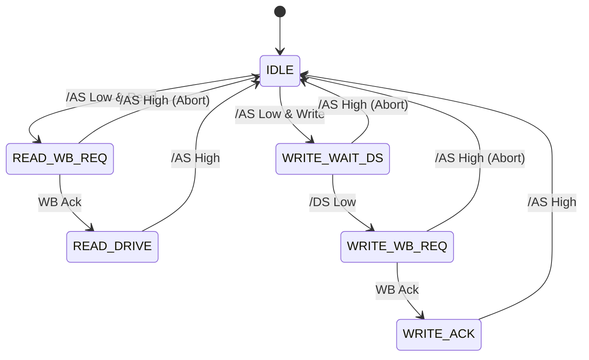

# SE30 PDS Bridge Module

**File**: `se30_bus.py`

## Purpose
The `SE30PDS` module acts as a bidirectional bridge between the asynchronous Motorola 68030 PDS bus and the internal synchronous Wishbone bus. It handles signal synchronization, bus arbitration, and protocol translation.

## Interfaces

### Platform Signals
Directly mapped to FPGA pins (see `ztex213_se30.py`).
- **Address/Data**: `pds_a_3v3_n` (32-bit), `pds_d_3v3_n` (32-bit)
- **Control**: `/AS`, `/DS`, `R/W`, `/DSACK0`, `/DSACK1`, `SIZ0`, `SIZ1`, `/BERR`
- **Arbitration**: `/BR`, `/BG`, `/BGACK`
- **Interrupts**: `/IRQ1`, `/IRQ2`, `/IRQ3` (mapped via `irq_3v3_n`)

### Wishbone Interfaces
- **`wb_read` (Master)**: Initiates internal WB reads when Mac CPU reads from FPGA (Slave Mode).
- **`wb_write` (Master)**: Initiates internal WB writes when Mac CPU writes to FPGA (Slave Mode).
- **`wb_dma` (Slave)**: Receives WB requests from internal masters to perform DMA on the Mac bus (Master Mode).

## Finite State Machines (FSMs)

### Slave FSM (Mac accessing FPGA)
Handles `READ` and `WRITE` cycles initiated by the Mac CPU.
1. **IDLE**: Waits for falling edge of `/AS` and matching Slot Address (`0xF9`, `0xFA`, `0xFB`).
2. **READ/WRITE_REQ**: Initiates Wishbone cycle.
    - **Cycle Abort**: If `/AS` goes High (inactive) while in this state, the FSM aborts and returns to `IDLE`.
3. **DRIVE/ACK**: Drives data (on read) and asserts `/DSACK`.
4. **COMPLETE**: Waits for `/AS` negation.

### Master FSM (FPGA DMA to Mac)
Handles Bus Arbitration and Transfer when the FPGA needs to access Mac system memory.
1. **Arbitration**: Asserts `/BR`, waits for `/BG`, asserts `/BGACK`.
2. **Transfer**: Drives Address/Control, asserts `/AS` & `/DS`.
3. **Wait**: Waits for `/DSACK` (Success) or `/BERR` (Error).
    - **Bus Error**: If `/BERR` is asserted, the cycle is aborted and the Wishbone transaction is acknowledged (to prevent hang), but effectively terminated.
4. **Release**: Releases Bus.

## Implementation Details

### Signal Synchronization
All asynchronous inputs (`/AS`, `/DS`, Address, etc.) are synchronized using `migen.genlib.cdc.MultiReg` to the system clock domain to prevent metastability.

### Open-Drain Emulation
Signals like `/IRQ`, `/BR`, `/BGACK`, and Data Bus (in some modes) use `Tristate` primitives to emulate Open-Drain/Bidirectional behavior.
- **Interrupts**: The `irq_out` signal (3 bits) from the SoC is mapped to open-drain outputs to assert interrupts to the Mac. Input monitoring is not currently implemented.

### Address Decoding
The Slave logic decodes addresses starting with:
- `0xF9xxxxxx` (Slot 9)
- `0xFAxxxxxx` (Slot A)
- `0xFBxxxxxx` (Slot B)

### Byte Lane Selection
Logic converts synchronized `SIZ0`, `SIZ1`, `A0`, and `A1` signals into Wishbone `SEL` signals (4-bit active high) to support proper Byte, Word, and Long Word alignment.

| SIZ[1:0] | A[1:0] | Transfer Size | Wishbone SEL (Binary) | Description |
| :--- | :--- | :--- | :--- | :--- |
| 00 | xx | Long Word | 1111 | 32-bit transfer |
| 01 | 00 | Byte | 1000 | Byte 3 (MSB) |
| 01 | 01 | Byte | 0100 | Byte 2 |
| 01 | 10 | Byte | 0010 | Byte 1 |
| 01 | 11 | Byte | 0001 | Byte 0 (LSB) |
| 10 | 00 | Word | 1100 | Upper Word |
| 10 | 10 | Word | 0011 | Lower Word |
| 11 | 00 | 3 Bytes | 1110 | Upper 3 Bytes |

*Note: The table above represents the mapping logic implemented in `se30_bus.py`.*
